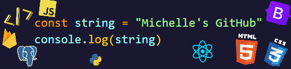

  

<h2>Hi, I'm Michelle Green!</h2>
<h3><em>Front End Developer</em></h3>

### About me:
:green_heart: I am currently open to career opportunities! 
:green_heart: I have recently studied at Coding Temple, where I learned the technologies displayed below. 
:green_heart: Pronouns: they/them 
:green_heart: Currently studying:&nbsp;&nbsp;&nbsp; 

Contact me by <a href="mailto:chellegreen99@gmail.com">email</a> or <a href="https://www.linkedin.com/in/michelle-green-527a27244/">LinkedIn</a>.
 
